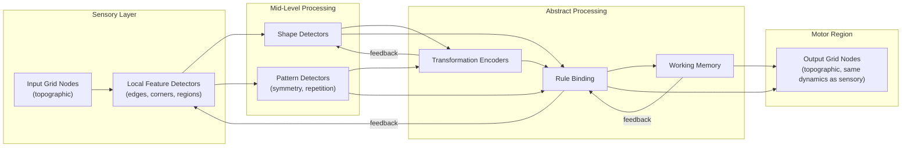

# Architecture: The Genetic Template

The genetic template defines *what the network knows before it sees any data*. In the brain, this is the product of millions of years of evolution. For us, it is found through **evolutionary search** over template parameters.

---

## 1. What the Template Specifies

The brain's genome does NOT specify individual connections (~100 trillion synapses from ~20,000 genes is impossible). It specifies:

1. **Neuron types** -- excitatory, inhibitory (PV, SOM subtypes), modulatory. Different electrical properties, connectivity rules, and plasticity rates.
2. **Regional organization** -- distinct areas with specialized functions
3. **Connectivity rules** -- "neurons of type X in region A connect to type Y in region B with probability P"
4. **Topographic mappings** -- spatial structure in the world preserved in cortical wiring
5. **Canonical microcircuit motifs** -- repeated modular units with stereotypical internal structure
6. **Hierarchical gradients** -- progressive changes from sensory to association areas

Similarly, our template specifies topology and structure. Specific weight values, time constants, and detailed connectivity are left to plasticity.

---

## 2. Functional Regions



- **Sensory Layer:** Topographic grid preserving 2D spatial structure. Each cell gets nodes for color encoding. Local connections between spatial neighbors. Local feature detector microcircuits for edges, corners, uniform regions, and color adjacencies.
- **Mid-Level Processing:** Pools from local detectors to recognize shapes (rectangles, lines, L-shapes), patterns (symmetry axes, repetition, gradients). Larger receptive fields.
- **Abstract Processing:** Encodes relationships and transformations (not spatial features). Transformation encoders, rule binding (input-output mapping), working memory (recurrent, persistent).
- **Motor Region:** Topographic grid mirroring output format. These are architecturally identical to sensory nodes -- same type (excitatory), same dynamics, same plasticity. What makes them "output" is only that (a) we inject the expected answer into them during training and (b) we read from them during testing. They receive **no external signal during testing** and activate purely through learned internal connections. Readout is gated by confidence: the network outputs only when motor node activations cross a threshold (integration-to-bound model, see [Mathematics](03_Mathematics.md) Section 2b).

---

## 3. Canonical Microcircuit Motifs

Every region is built from repeated instances of a canonical microcircuit:

```
Canonical Microcircuit:

    Input from lower region
           |
           v
    [E1] ---> [E2] ---> [E3]     (excitatory chain, recurrently connected)
      |         |         |
      +----+----+----+----+
           |
           v
         [I1]                      (inhibitory interneuron)
           |
           +---> lateral inhibition to neighboring microcircuits
           +---> divisive normalization within this microcircuit

    [E3] ---> output to higher region
    [E3] <--- feedback from higher region
```

- **Excitatory population (E):** 3-5 nodes with recurrent connections. Amplify and maintain signals. Their patterns represent information.
- **Inhibitory population (I):** 1-2 nodes with negative-weight connections to nearby excitatory populations. Implements lateral inhibition (winner-take-all competition) and divisive normalization (prevents runaway excitation).
- **Feedforward connections:** Lower -> higher regions (bottom-up).
- **Feedback connections:** Higher -> lower regions (top-down prediction/modulation).

---

## 4. Node Types

| Node Type | Activation | Excitability | Plasticity Rate | Role |
|---|---|---|---|---|
| Excitatory (E) | tanh | medium (1.0) | medium | Represent and propagate information |
| Inhibitory (I) | tanh, output negated | high (1.5) | low | Competition, normalization, sharpening |
| Modulatory (M) | sigmoid -> [0,1] | low (0.5) | very low | Gate/multiply other signals (attention) |
| Memory (Mem) | tanh, very low leak | medium (1.0) | very low | Maintain state across many timesteps |

**Dale's Law:** Inhibitory nodes always output non-positive values. This is a hard constraint, not learned.

---

## 5. What Template Encodes vs. What Plasticity Learns

| Genetic Template (Fixed) | Plastic (Learned at Runtime) |
|---|---|
| Regional layout and roles | Specific feature selectivities |
| Neuron types per region | Connection strengths (weights) |
| Broad connectivity rules | Time constants / leak rates |
| Topographic spatial mappings | Intrinsic excitability (gain) |
| Canonical microcircuit structure | Detailed connectivity (via pruning) |
| E/I ratio per region | Task-specific assemblies |
| Initial connection overproduction | Which connections survive pruning |

Almost everything that matters for task-specific performance is plastic. The template provides the *scaffold*; plasticity fills in the details.

---

## 6. Finding Templates via Evolutionary Search

Since the genetic template is the product of evolution in biology, we use the same strategy:

1. **Parameterize the template** as a vector of numbers: region sizes, connectivity probabilities, E/I ratios, initial connection density, microcircuit size, etc.
2. **Generate a population** of candidate templates with varied parameters
3. **Evaluate** each on a set of ARC training tasks (run the full DNG pipeline, score accuracy)
4. **Select** the best performers, **mutate** their parameters, produce next generation
5. **Repeat** until convergence

This is essentially NEAT applied to our seed network template rather than to individual network weights. The "genome" encodes the *rules for building the network*, not the network itself.

A lucky template might perform surprisingly well even if our plasticity rules are imperfect -- just as in biology, where some species have innate capabilities that require minimal learning.

---

## 7. Approximate Scale

For a 30x30 ARC grid (maximum size):

- **Sensory layer:** 30 x 30 x 10 = 9,000 input nodes + ~2,000 feature detectors
- **Mid-level processing:** ~500-1,000 nodes
- **Abstract processing:** ~200-500 nodes
- **Motor region:** 30 x 30 x 10 = 9,000 output nodes (same node type as sensory)
- **Total:** ~20,000-22,000 nodes (all present from initialization, never grows)
- **Initial connections:** ~80,000-400,000 (overproduced, will be pruned)

Smaller grids use proportionally fewer sensory/motor nodes. The intermediate regions scale less aggressively.
