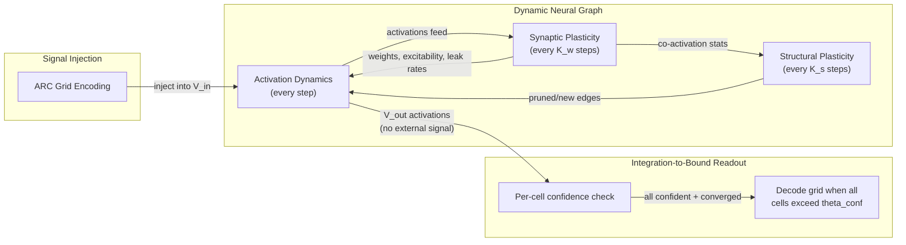

# Mathematical Framework

Formal definitions, dynamics, plasticity rules, and energy function for the Dynamic Neural Graph.

---

## 1. Definitions

**Definition 1: Dynamic Neural Graph.** At discrete time t, a DNG is:

```
N(t) = ( V, E(t), a(t), W(t), b(t), alpha(t), tau, R )
```

- `V` -- **fixed** finite set of node indices, partitioned into V_in (sensory) and V_out (motor). All are regular nodes obeying the same dynamics. V_out nodes are architecturally identical to V_in nodes -- they are distinguished only by how we interact with them (inject signal into V_in, read from V_out). Intermediate processing regions exist but are not a separate partition -- they are subsets of V with region labels. Does not change at runtime.
- `E(t) ⊆ V x V` -- set of directed edges. **Shrinks** over time via pruning (starts overproduced). Limited new connections possible via co-activation.
- `a(t) : V -> [-1, 1]` -- activation state per node (scalar; vector-valued in future versions)
- `W(t) : E(t) -> R` -- weight per edge
- `b(t) : V -> R+` -- intrinsic excitability (gain) per node. **Plastic.**
- `alpha(t) : V -> (0, 1)` -- leak rate per node. **Plastic.** (initialized by type, refined by experience)
- `tau : V -> {E, I, M, Mem}` -- node type. **Fixed** from genetic template. Determines activation function and sign constraints.
- `R : V -> {sensory, local_detect, mid_level, abstract, motor}` -- region assignment. **Fixed** from genetic template. Constrains which regions a node can connect to.

**Definition 2: Signal.** A function `s : V_in x {0,...,T} -> R` assigning time-varying input to input nodes.

**Definition 3: Genetic Template.** A specification `G = (R_spec, M_spec, C_spec)` where:

- `R_spec` -- region definitions (sizes, spatial layouts, node type ratios)
- `M_spec` -- canonical microcircuit motif (internal wiring pattern)
- `C_spec` -- inter-region connectivity rules (which regions connect, probability, feedforward/feedback)

G is used once to instantiate N(0). The initial E(0) is **overproduced** -- more connections than the mature network needs, following the overshoot-prune biological model.

---

## 2. Process 1 -- Activation Dynamics (Fast Timescale)

Every timestep, each node updates based on its type:

**Excitatory and Memory nodes (tau = E or Mem):**

```
a_i(t+1) = tanh( b_i(t) * [ (1 - alpha_i(t)) * a_i(t)  +  alpha_i(t) * SUM_{j:(j,i) in E(t)} W_ji(t) * a_j(t) ]  +  s_i(t) )
```

**Inhibitory nodes (tau = I):** Always output non-positive (Dale's Law):

```
a_i(t+1) = -|tanh( b_i(t) * [ (1 - alpha_i(t)) * a_i(t)  +  alpha_i(t) * SUM_{j:(j,i) in E(t)} W_ji(t) * a_j(t) ] )|
```

**Modulatory nodes (tau = M):** Output in [0, 1], act as multiplicative gates:

```
a_i(t+1) = sigmoid( b_i(t) * [ (1 - alpha_i(t)) * a_i(t)  +  alpha_i(t) * SUM_{j:(j,i) in E(t)} W_ji(t) * a_j(t) ] )
```

**Initial leak rates (from template, then plastic):**

- `alpha_E ~ 0.3` (moderate leak for excitatory)
- `alpha_Mem ~ 0.05` (very low leak for memory -- persistent activity)
- `alpha_I ~ 0.5` (fast leak for inhibitory -- rapid response)
- `alpha_M ~ 0.2` (moderate for modulatory)

**Noise injection:** During rest/replay phases (no external signal), low-amplitude noise is added:

```
s_i(t) = epsilon_noise * N(0, 1)    (during rest phases only)
```

This serves two purposes: (1) prevents the network from collapsing to the zero attractor when external signals are removed, and (2) enables exploration of nearby attractors during internal replay, potentially finding better representations.

**Convergence:** When `alpha < 1` and the spectral radius of the weight matrix is bounded, the activation dynamics is a contraction mapping. By the Banach Fixed-Point Theorem, iteration converges to a unique attractor for given inputs. The attractor IS the network's "interpretation."

### 2b. Integration-to-Bound Output Readout

V_out nodes receive **no external signal during testing**. They activate solely through learned internal connections. Readout is gated by a confidence condition, not a fixed timer -- the network decides when it has an answer.

**Per-cell confidence:** For each output cell (r, c), the 10 color-channel nodes form a local readout group. Define:

```
conf(r,c)(t) = max_k a_{r,c,k}(t) - second_max_k a_{r,c,k}(t)
```

The cell is "decided" when `conf(r,c)(t) > theta_conf` (the winning color is clearly dominant).

**Global readout condition:** The output is read when:

1. **All cells are decided:** `conf(r,c)(t) > theta_conf` for every (r, c) in the output grid
2. **Activations have converged:** `max_i |a_i(t) - a_i(t-1)| < epsilon_converge`

If neither condition is met within a generous step budget `T_max`, the network is **undecided** -- it cannot solve the task with its current learned structure.

**Biological basis:** This mirrors the integration-to-bound model in motor cortex. Neurons in the supplementary motor area accumulate evidence (activation ramping up) until crossing a threshold (the readiness potential), triggering action. The network doesn't output on a clock -- it outputs when ready. Easy tasks converge fast; hard tasks take longer; impossible tasks never converge.

> **NOTE:** `theta_conf` and `T_max` are hyperparameters. A natural starting point is `theta_conf ~ 0.3` (moderate separation between top two colors) and `T_max ~ 500` (generous budget).

---

## 3. Process 2 -- Synaptic Plasticity (Medium Timescale)

Executed every K_w activation steps. Updates weights, excitability, and leak rates.

### 3a. Hebbian Weight Update

For each edge (j, i) in E(t):

```
delta_W_ji = eta_w * a_j(t) * a_i(t)  -  lambda_w * W_ji(t)
W_ji(t+1) = clip( W_ji(t) + delta_W_ji,  -W_max,  W_max )
```

- Plain Hebbian correlation: strengthens connections between co-active nodes, weakens anti-correlated pairs. Works correctly with signed activations in [-1, 1].
- `lambda_w * W_ji(t)` -- weight decay (regularization, prevents runaway growth).
- `clip` -- hard bounds prevent extreme weights.

> **Design note:** We originally used BCM (Bienenstock-Cooper-Munro), which adds a sliding threshold `theta_i = EMA(a_i^2)`. BCM was designed for non-negative firing rates. With signed `tanh` activations in [-1, 1], the BCM threshold inverts the learning signal for negative activations, causing incorrect weight updates. Plain Hebbian with weight decay is sufficient. The surprise-modulated learning rate (Section 3e) provides additional regulation.

### 3b. Homeostatic Excitability Update

Each node adjusts gain to maintain a target activation level:

```
b_i(t+1) = clip( b_i(t) + eta_b * (a_target - EMA(|a_i|)),  b_min,  b_max )
```

Under-active nodes become more excitable; over-active nodes dampen. This prevents the network from collapsing to silence or exploding to saturation.

### 3c. Leak Rate Adaptation

Each node adjusts its time constant based on its functional role:

```
alpha_i(t+1) = clip( alpha_i(t) + eta_alpha * (variance_target - Var(a_i, recent)),  alpha_min,  alpha_max )
```

Nodes with high activation variance (rapidly changing) increase their leak rate. Nodes with low variance (steady signals) decrease it. This allows self-organized temporal dynamics.

> **NOTE:** The leak rate adaptation rule is preliminary. The exact form needs empirical tuning. The key insight is that time constants ARE plastic (confirmed by neuroscience), so we need some rule for adjusting them. The specific rule may change after prototyping.

---

### 3d. Sleep Phase: Global Synaptic Downscaling

Applied once per training example (after the rest/replay phase). A bulk operation on ALL weights simultaneously:

```
W_ji(t+1) = sleep_factor * W_ji(t)    for all (j, i) in E(t)
```

Where `sleep_factor` is in the range [0.8, 0.95]. This is NOT the same as per-connection weight decay (which runs every K_w steps). Sleep is a global, simultaneous rescaling inspired by the Synaptic Homeostasis Hypothesis (see [Biological Foundations](01_Biological_Foundations.md), Section 8).

**Effect:** Strong connections (|W| >> 0) remain strong after scaling. Weak connections (|W| near 0) become even weaker and more likely to be pruned. This promotes generalization by removing overfitting to specific training examples while preserving the robust rule-encoding pathways.

> **NOTE:** The sleep_factor is a hyperparameter. Too aggressive (0.5) would destroy learned structure. Too gentle (0.99) would have negligible effect. The biological equivalent takes ~8 hours to downscale a full day of learning, suggesting a moderate factor per training example is appropriate.

---

### 3e. Prediction Error and Surprise-Modulated Learning

The DNG learns through **observation, not supervision**. Grids are presented sequentially through a fixed-size sensory window. Learning is driven by prediction error:

**Prediction error drives weight updates.** When a new grid is presented, the mismatch between the network's current internal state and the new input creates a large activation change. Hebbian learning fires hardest on these surprises -- unexpected co-activations produce the largest weight updates. As the network learns to predict correctly, surprise decreases and learning naturally slows.

**Surprise-modulated learning rate (optional):** A simple scalar modulator:

```
surprise(t) = mean(|a_i(t) - a_i(t-1)|)  over all nodes i
effective_eta(t) = eta_base * (1 + k_surprise * surprise(t))
```

High surprise = large activation shift when new input arrives = boost learning rate.
Low surprise = the network expected this input = lower learning rate.

This is a minimal analog of dopaminergic modulation -- one scalar value, no neurotransmitter infrastructure. It encourages rapid learning from novel information and stability when the network already understands.

> **NOTE on the binding problem:** In the earlier supervised approach, we solved the binding problem by extracting color mappings and presenting them one at a time. In the observation-based approach, the network must solve this itself through its recurrent dynamics. This is an open question -- whether the network can develop its own internal attention mechanism through the interplay of excitatory, inhibitory, and modulatory nodes. If it can't, it may be the first clear sign that the genome (template) needs more structure.

---

## 4. Process 3 -- Structural Plasticity (Slow Timescale)

Executed every K_s plasticity steps (K_s >> K_w). Connections only -- no node creation or removal.

### 4a. Pruning (Primary Mechanism)

The initial network starts with overproduced connections. Pruning sculpts this into an efficient circuit:

```
If |W_ji(t)| < epsilon_prune for T_prune consecutive plasticity steps:
    remove edge (j, i) from E(t)
```

Connections that remain weak despite repeated plasticity updates are not useful -- they get pruned. **What you DON'T connect matters as much as what you do.**

### 4b. Limited New Connection Formation (Secondary Mechanism)

For unconnected pairs (j, i) within topological distance D and consistent with region-to-region rules (C_spec), track a co-activation trace:

```
C_ji(t+1) = (1 - beta) * C_ji(t)  +  beta * |a_j(t) * a_i(t)|
```

If `C_ji > theta_edge`, create edge with initial weight `W_ji = sign(a_j * a_i) * gamma * C_ji`.

Most structure comes from pruning the initial overshoot; new connections form only when two unconnected nodes are persistently co-activated.

**Computational constraint:** Only track C for node pairs within D hops (D ~ 2-3). Cost: O(|V| * avg_degree^D), not O(|V|^2).

> **NOTE:** The biological evidence suggests connection formation involves molecular guidance cues that we don't model. Our co-activation trace is a simplification. The overshoot-prune approach reduces our dependence on getting synaptogenesis exactly right.

---

## 5. Complete Plasticity Catalog

| What Changes | Update Rule | Timescale | Section |
|---|---|---|---|
| Activations a(t) | Leaky recurrent integration + nonlinearity (+ noise during rest) | Every step | 2 |
| Weights W(t) | Hebbian correlation + weight decay + clipping | Every K_w steps | 3a |
| Excitability b(t) | Homeostatic gain adjustment toward target activation | Every K_w steps | 3b |
| Leak rates alpha(t) | Variance-driven adaptation | Every K_w steps | 3c |
| Weights W(t) (bulk) | Global sleep downscaling (multiply all W by sleep_factor) | Per training example | 3d |
| Connections E(t) | Pruning (remove weak edges) + limited growth (co-activation) | Every K_s steps | 4 |

**What does NOT change at runtime:**

- Node set V (all nodes present from template)
- Node types tau (E, I, M, Mem -- fixed by template)
- Region assignments R (fixed by template)
- Region-to-region connectivity constraints (from C_spec)

---

## 6. The Energy Function

The system implicitly minimizes:

```
E(t) = - (1/2) * SUM_{(j,i) in E(t)} W_ji(t) * a_i(t) * a_j(t)       [connection coherence]
        + (1/2) * SUM_i a_i(t)^2                                        [activation cost]
        + lambda_e * |E(t)|                                              [wiring cost]
```

- **Term 1:** Lower when co-active nodes have strong weights (rewards coherent patterns).
- **Term 2:** Penalizes excessive activation (encourages sparsity).
- **Term 3:** Penalizes too many connections (Occam's razor -- encourages pruning).

**Each process decreases E (informally):**

- **Activation dynamics:** Minimizes E w.r.t. a -- analogous to Hopfield dynamics. Contraction condition ensures convergence.
- **Hebbian plasticity:** Aligns W with activation correlations, decreasing Term 1. Weight decay prevents unbounded decrease.
- **Pruning:** Removes edges with small |W|, which contribute little to Term 1 but cost lambda_e in Term 3. Net effect: E decreases.
- **New edges:** Only formed when co-activation is strong enough that the coherence gain (Term 1) exceeds wiring cost (Term 3).

> **NOTE:** This is a plausibility argument, not a rigorous proof. The interaction between processes makes formal Lyapunov analysis difficult. A more rigorous treatment following the Free Energy Principle framework is future work.

---

## 7. System Diagram


