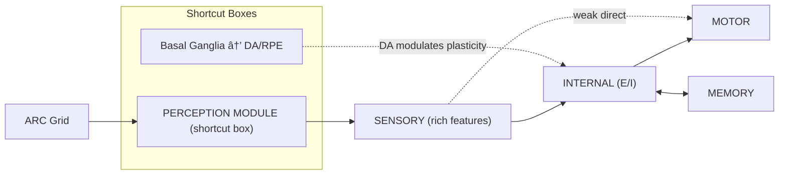
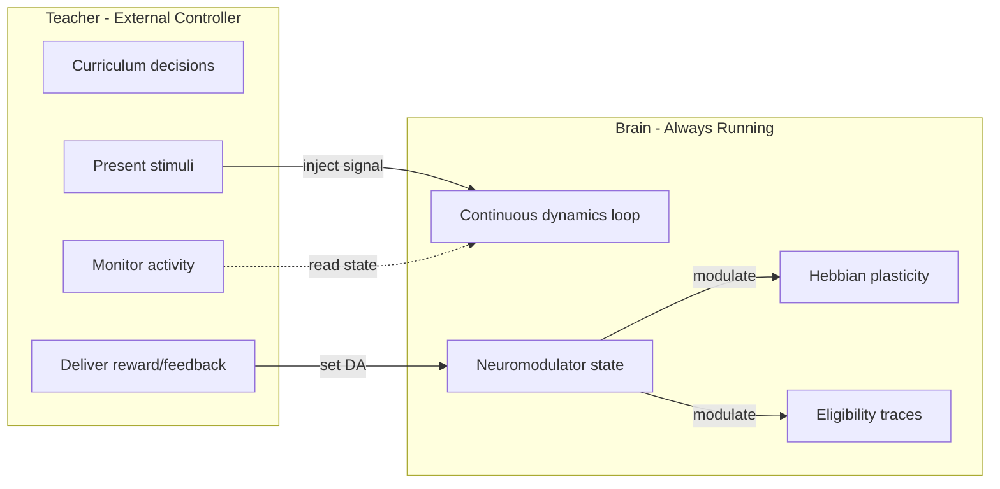

# Biologically Grounded DNG Overhaul

## Guiding Principle: Evolutionary Minimalism

Different animals have wildly different brains, but most can learn. Crows reason without cortical layers. Honeybees learn associations with ~1 million neurons. Even C. elegans (302 neurons) does basic learning.

This means the SPECIFIC architecture doesn't make reasoning work — the CONSERVED COMPUTATIONAL PRINCIPLES do. Our model has ~4000 neurons. That's honeybee-scale, not human-scale. We should build the minimum viable brain using mechanisms conserved across ALL learning brains, not a miniature human brain.

**Phase 1 (build now) — Conserved across all learning brains:**

- E/I balance (excitatory + inhibitory neurons)
- DA-modulated plasticity (reward signal)
- Hebbian learning (co-activity strengthens)
- Error correction (CHL)
- Eligibility traces (delayed reward credit)
- Refractory period (universal in all neurons)
- Adaptation (homeostatic)
- Structural plasticity (grow/prune)
- Sleep/consolidation (replay + downscaling — even flies do this)
- Simple architecture: SENSORY → INTERNAL → MOTOR (+ MEMORY)
- Per-node parameters (neurons ARE different types)
- Continuous brain engine + Teacher + lifecycle

**Phase 2 (add ONLY when Phase 1 hits a wall) — Mammalian enhancements:**

- Inhibitory subtypes (PV+, SST+, VIP+) — add if E/I alone can't produce stable competition
- Hierarchical visual regions (LOCAL_DETECT, MID_LEVEL) — add if single internal layer can't learn features
- Prefrontal cortex — add if working memory fails from recurrence alone
- REM dream phase — add if basic sleep consolidation isn't enough
- Amygdala salience — add if DA alone doesn't modulate consolidation properly
- Thalamic gating — add if attention/feature selection fails
- Multiple neuromodulators (NE, ACh as separate systems) — add if DA alone isn't flexible enough

**The test:** get the minimum viable brain learning identity tasks first. Then add complexity only to solve specific failure modes.

## Scope

Phase 1: Build the conserved-mechanism brain with the continuous lifecycle architecture. Fix the neuron model, synapse model, plasticity, and replace the batch pipeline with an always-on brain + teacher. Shortcuts for subsystems where only the output matters.

---

## A. Neuron Model Fixes

### A1. Refractory Period

**What biology does:** After firing, a neuron enters a ~1-2ms absolute refractory period where it cannot fire, followed by a relative refractory period where it's harder to fire.

**Our timescale:** Our timesteps are abstract integration cycles, not milliseconds. The functional purpose — prevent runaway dominance, create temporal sparsity — is served by 1 step of strong suppression.

**Change in [src/numba_kernels.py](src/numba_kernels.py):** In all `run_steps`* kernels, after computing `ri`:

```python
if prev_r[i] > 0.8 * max_rate:  # was strongly active last step
    ri *= 0.1                     # strong suppression (relative refractory)
```

This is simple, cheap, and creates the temporal alternation biology uses. No new arrays needed — `prev_r` already exists.

### A2. Per-Node Parameters

**Phase 1 change:** Convert `adapt_rate` and `max_rate` from global scalars to per-node arrays in [src/graph.py](src/graph.py). This is needed because E and I neurons already have different intrinsic properties. Update [src/numba_kernels.py](src/numba_kernels.py) to read per-node values. Template sets different defaults for E vs I.

### A3. Inhibitory Neuron Subtypes — PHASE 2

**Deferred.** Three inhibitory subtypes (PV+, SST+, VIP+) are mammalian-cortex specific. Simpler brains have just E and I neurons and they learn. Our existing E/I balance + WTA may be sufficient at ~4000 neurons.

**Add if:** Simple E/I produces unstable dynamics (runaway excitation or complete suppression) that WTA alone can't fix, or if the network can't do selective gating (attend to one feature while ignoring another).

**Details preserved for when needed:**

- PV+: fast-spiking perisomatic inhibition, drives competition. Low adaptation, high max rate.
- SST+: dendritic inhibition, gates inputs. Higher adaptation, slower.
- VIP+: inhibits other inhibitory neurons (disinhibition), enables flexible routing.
- Split: ~50% PV+, ~30% SST+, ~20% VIP+. VIP+ projects only to other inhibitory neurons.

---

## B. Synapse Model Fixes

### B1. Eligibility Traces

**What biology does:** When a synapse is active (pre and post co-fire), calcium/enzyme cascades leave a biochemical "tag" that decays over seconds. When a neuromodulator (DA) arrives later, only tagged synapses get modified. This solves credit assignment: the network acts, gets feedback, and only the responsible synapses are updated.

**Changes in [src/graph.py](src/graph.py):**

- New per-edge array: `_edge_eligibility` (float64, same size as `_edge_w`)
- Include in `save()`, `load()`, `add_edges_batch()`, `_ensure_capacity()`

**Changes in [src/numba_kernels.py](src/numba_kernels.py):** In `run_steps_plastic`, every step (not just plasticity_interval):

```python
# Eligibility: decay + accumulate from co-activity
for e in range(n_edges):
    edge_elig[e] *= elig_decay          # ~0.95/step
    pre_r = r[edge_src[e]]
    post_r = r[edge_dst[e]]
    if pre_r > 0.01 and post_r > 0.01:
        edge_elig[e] += pre_r * post_r  # tag this synapse
```

**New function in [src/plasticity.py](src/plasticity.py):**

```python
def eligibility_update(net, DA, eta, w_max):
    """Apply delayed reward signal to eligible synapses."""
    elig = net._edge_eligibility[:net._edge_count]
    dw = eta * DA * elig
    # Dale's law, clip, apply, then decay traces
```

### B2. Synaptic Consolidation (activate existing code)

`consolidate_synapses` exists in [src/plasticity.py](src/plasticity.py) but is never called. Wire it into the pipeline: after a successful task (reward > threshold), consolidate the changed synapses so they resist future modification.

### B3. Per-Neuron Adaptation/Max Rate (from A2)

Change `adapt_rate` and `max_rate` from global scalars to per-node arrays in [src/graph.py](src/graph.py). This enables inhibitory subtypes to have different dynamics and is more biologically accurate generally (different neuron types have different intrinsic properties).

---

## C. Brain Regions and Pathways

### Design Principle: Evolutionary Minimalism

A honeybee learns with: sensory → mushroom body → motor. Crows reason without cortical layers. Our model has ~4000 neurons — honeybee scale, not human scale.

**Not every brain region needs neurons.** The rule:

- **Real neurons** if the region builds *representations* through synaptic plasticity
- **Shortcut box** if only its *output* matters (a function that computes a value)

For real-neuron regions, the template is GENETICS — creates the initial pool with E and I neurons and sparse connectivity. Synaptogenesis + plasticity during development build the working circuit.

### C1. Phase 1 Architecture (build now — conserved, minimal)




Four neural regions + two shortcut boxes. The Perception Module does heavy preprocessing before signals reach the neural network — like the retina + V1 does before cortex.

**SENSORY** — rich feature layer. NOT raw pixels. The Perception Module (section C4) precomputes per-cell and global features. ~20 nodes per cell + ~28 global nodes. Fixed layout, not learned.

**INTERNAL** — the main processing region. Current "internal" + "concept" pools merged.

- E and I neurons (~80/20 ratio) — NOT subtypes, just E and I
- Local receptive fields from SENSORY (existing `_local_rf_edges`)
- Lateral recurrent connections (existing internal-to-internal)
- Bidirectional connections to MEMORY
- Projects to MOTOR
- Feedback from MOTOR
- This is our "mushroom body" — the single layer where learning happens

**MEMORY** — episodic storage and pattern completion.

- Very slow leak (persistent activity, existing)
- Self-connections (attractor dynamics, existing)
- Bidirectional with INTERNAL
- Existing pool, mostly unchanged

**MOTOR** — output grid, one-hot encoding matching SENSORY.

- Per-cell WTA (one color wins per position)
- Copy pathway instinct (sensory→motor, existing)
- All readout uses firing rates (`net.r`), not membrane potential

### C2. Phase 1 Shortcut Box

**Basal ganglia → DA (reward prediction error)**

- Only neuromodulator shortcut in Phase 1
- DA = RPE = reward - prediction
- Positive RPE → DA spike (strengthen via eligibility)
- Negative RPE → DA dip below baseline (WEAKEN via eligibility)
- NE and ACh effects approximated by adjusting DA baselines and WTA strength directly

### C3. Perception Module (shortcut box — CNN-inspired, biologically justified)

**Why:** Many ARC tasks are fundamentally perception problems. In biology, the retina and V1 do heavy feature extraction before "thinking" cortex sees anything. A baby detects edges from birth — it's genetic, not learned. We should hardwire the same.

**Justification:** This is a shortcut box. We care about the OUTPUT (rich features), not the mechanism. A real brain computes these via complex retinal/V1 circuits. We compute them algorithmically. Same result.

**New file: [src/perception.py](src/perception.py)**

Runs once per stimulus presentation (not per tick). Takes a raw ARC grid, returns a rich feature vector for the sensory layer.

**Level 1 — Per-cell local features (~20 nodes per cell):**

- One-hot color (10 nodes) — existing
- 4-directional color boundary: is orthogonal neighbor a different color? (4 nodes) — edge detection
- 4-directional diagonal boundary: is diagonal neighbor different? (4 nodes) — corner detection
- Same-color orthogonal neighbor count, normalized (1 node) — texture/interior signal
- Is grid border cell (1 node) — spatial context

**Level 2 — Per-cell object/region features (~8 nodes per cell):**

Uses connected component analysis (flood fill) — computed once, O(n) — to give the brain "object awareness" for free.

- Object size this cell belongs to, normalized by grid area (1 node)
- Is cell on object boundary vs interior (1 node)
- Relative position within object bounding box: top/bottom/left/right distance normalized (4 nodes)
- Number of objects of same color in grid (1 node, normalized)
- Object compactness: area / bounding-box-area (1 node) — distinguishes lines from blobs

**Level 3 — Global grid features (~28 dedicated sensory nodes, broadcast):**

- Color histogram: fraction of grid that is each color (10 nodes)
- Background color: most common color, one-hot (10 nodes)
- Grid symmetry: horizontal, vertical, 180° rotation, transpose (4 nodes)
- Number of distinct colors used, normalized (1 node)
- Total number of objects, normalized (1 node)
- Grid aspect ratio (1 node)
- Grid fill ratio: non-background cells / total cells (1 node)

**Total sensory encoding per grid:**

- Per-cell: ~28 nodes × (h × w) cells
- Global: ~28 nodes
- For 5×5 grid: 700 + 28 = 728 sensory nodes (up from 250)

This triples the sensory input but gives INTERNAL dramatically more to work with. The INTERNAL layer no longer needs to discover what an "object" is or where boundaries are — it gets that for free and can focus on learning transformations.

**Motor output stays simple:** 10 nodes per cell (one-hot color), argmax readout. Motor doesn't need the rich features — it just needs to output a color per cell. The perception features help INTERNAL figure out WHAT to output, not HOW to output it.

**Copy pathway update:** The instinct copy pathway wires sensory one-hot color nodes to motor nodes (the first 10 of the ~28 per-cell features). Other perception features don't connect directly to motor — they inform INTERNAL.

### C4. Phase 2 Additions — DEFERRED (add only for specific failures)

Each addition below has a specific trigger condition. Don't add preemptively.

**Hierarchical visual regions (LOCAL_DETECT, MID_LEVEL)**

- Trigger: INTERNAL can't learn spatial feature detectors (edges, shapes)
- What: SENSORY → LOCAL_DETECT (small RF) → MID_LEVEL (larger RF) → ABSTRACT (global)
- Bidirectional (top-down = predictions)

**PREFRONTAL (working memory)**

- Trigger: brain can't hold input patterns while generating output
- What: strong recurrent excitation for sustained activity, very slow leak, WTA

**NE as separate system (locus coeruleus)**

- Trigger: DA alone can't produce focused vs diffuse processing
- What: NE sharpens WTA during task, relaxes it during rest

**ACh as separate system (basal forebrain)**

- Trigger: plasticity needs stage-dependent gating beyond DA
- What: ACh gates overall plasticity rate by developmental stage

**Amygdala salience**

- Trigger: DA valence alone doesn't modulate consolidation properly
- What: salience = |RPE| scales memory consolidation strength

**Inhibitory subtypes (PV+, SST+, VIP+)**

- Trigger: E/I balance alone can't produce stable competition or selective gating
- What: PV+ (fast competition), SST+ (input gating), VIP+ (disinhibition)

**Thalamic gating**

- Trigger: brain can't selectively attend to relevant features
- What: gate sensory input based on PFC signals and arousal

---

## D. Plasticity: Multiple Concurrent Mechanisms

All plasticity runs continuously, gated by neuromodulators — not by code flags. The brain doesn't have a "learning mode." Plasticity is always on; DA/ACh/NE determine how much and what kind.

### D1. Always-On Plasticity Rules


| Mechanism         | Runs when        | What it does                                                             | Gated by                        |
| ----------------- | ---------------- | ------------------------------------------------------------------------ | ------------------------------- |
| **Hebbian+DA**    | Every step       | Builds associations from co-activity                                     | DA level                        |
| **Eligibility**   | Every step       | Tags active synapses; DA arrival later modifies tagged ones              | Trace accumulates; DA cashes in |
| **CHL**           | Periodically     | Compares recent "prediction" vs "reality" correlations; error-corrective | DA from RPE                     |
| **Consolidation** | After reward     | Protects strongly-modified synapses from future change                   | Reward threshold                |
| **Structural**    | End of day/sleep | Synaptogenesis + pruning                                                 | Activity levels                 |


The key insight: plasticity rules don't need explicit phase switches. DA being low during an attempt naturally suppresses Hebbian learning. DA spiking during reward naturally activates eligibility cashing. CHL naturally needs two correlation snapshots (before vs after seeing the answer). These arise from the stimulus sequence, not from code modes.

### D2. Sleep Plasticity (keep existing — all conserved mechanisms)

- CHL replay (already implemented — even flies do consolidation during sleep)
- SHY downscaling (already implemented — homeostatic)
- Pruning (already implemented — structural)
- Homeostatic excitability (already implemented)
- REM dreams: PHASE 2 (mammals/birds only, not conserved)

---

## E. Neuromodulators (Phase 1: DA Only)

In Phase 1, DA is the sole neuromodulator. This is biologically justified — dopamine-modulated learning is the single most conserved learning mechanism across species, from insects to humans.

### E1. DA: Reward Prediction Error (basal ganglia shortcut)

- DA at baseline (~0.05) during rest — gentle maintenance plasticity
- DA raised by Teacher when showing examples (~0.2-0.3, novelty/importance signal)
- DA near zero during attempts (no external feedback yet)
- DA spikes or dips based on RPE when outcome revealed
- DA during sleep replay = moderate (offline consolidation)
- Negative DA (RPE < 0) must ACTIVELY WEAKEN recently-active synapses via eligibility traces

### E2. NE, ACh, Salience — PHASE 2

Deferred. Their effects are approximated in Phase 1 by:

- **NE's WTA sharpening** → Teacher adjusts WTA parameters directly when presenting tasks vs rest
- **ACh's plasticity gating** → plasticity rate set by developmental stage config
- **Salience** → DA magnitude already reflects importance (|RPE|)

If DA alone can't produce the right learning dynamics, we add NE first (it has the most direct effect on attention/processing mode), then ACh, then salience.

---

## F. Continuous Brain Model

### F1. Core Principle: The Brain Never Stops

The model is a continuously running process. There is no "train mode" or "test mode." The brain runs dynamics every tick, forever. External interactions change what signals reach the brain and what neuromodulators are active. The brain responds accordingly.




**The brain** runs continuously: dynamics, plasticity, neuromodulator decay — all ticking.

**The teacher** is an external process that decides:

- What stimuli to present (inject signals into sensory/motor)
- When to deliver reward (set DA based on outcome)
- When to let the brain rest (remove stimuli, lower NE)
- When to trigger sleep (accumulated fatigue threshold)
- What to monitor and log

### F2. Implementation: Brain as a Package

The Brain is a complex system. One file won't cut it. It gets its own package:

```
src/brain/
    __init__.py          # exports Brain class
    engine.py            # Core Brain class: step(), signal injection, motor readout
    neuromodulators.py   # Phase 1: DA only (RPE, decay). Phase 2: add NE, ACh
    sleep.py             # Phase 1: NREM (CHL replay, SHY, pruning). Phase 2: add REM
    checkpoint.py        # Autosave, milestone saves, rolling window, resume
    fatigue.py           # Sleep pressure accumulation, needs_sleep()
```

**[src/brain/engine.py](src/brain/engine.py)** — The core:

```python
class Brain:
    """A continuously running neural system."""
    
    def __init__(self, net: DNG, config: BrainConfig):
        self.net = net
        self.config = config
        self.age = 0                   # total lifetime steps, never resets
        self.signal = None             # current external signal
        self.neuromod = NeuromodState() # DA, NE, ACh levels + decay
        self.fatigue = FatigueTracker()
        self.checkpointer = Checkpointer(config.checkpoint_dir)
        self.correlation_buffer = None # for CHL snapshots
    
    def step(self):
        """One tick of brain activity. Call in a loop, forever."""
        # 1. Dynamics: compute rates, update V, WTA, refractory
        # 2. Plasticity: Hebbian+DA (always on, scaled by DA level)
        # 3. Eligibility: traces accumulate from pre*post activity
        # 4. If DA changed recently: cash in eligibility traces
        # 5. Neuromodulator decay (DA, NE → baseline)
        # 6. Fatigue accumulation
        # 7. Periodic autosave check
        self.age += 1
    
    def inject_signal(self, signal: np.ndarray):
        """Teacher presents a stimulus."""
    
    def clear_signal(self):
        """Remove external stimulus — brain runs on its own."""
    
    def set_da(self, level: float):
        """External reward/punishment signal (basal ganglia shortcut)."""
    
    def set_ne(self, level: float):
        """External arousal signal (locus coeruleus shortcut)."""
    
    def snapshot_correlations(self) -> np.ndarray:
        """Capture current activity correlations for CHL comparison."""
    
    def apply_chl(self, before: np.ndarray, after: np.ndarray):
        """Error-corrective update from correlation comparison."""
    
    def read_motor(self) -> np.ndarray:
        """Read motor firing rates without stopping the brain."""
    
    def needs_sleep(self) -> bool:
        """Fatigue threshold exceeded?"""
    
    def sleep(self):
        """Full sleep cycle: NREM replay + SHY + pruning + REM dreams."""
    
    def save(self):
        """Save full brain state to checkpoint."""
    
    @classmethod
    def load(cls, path: str) -> "Brain":
        """Wake up from checkpoint."""
```

### F3. Teacher / Curriculum Controller

**New file: [src/teacher.py](src/teacher.py)** — External controller

```python
class Teacher:
    """Decides what to show the brain and when."""
    
    def __init__(self, brain: Brain, curriculum: Curriculum, config: TeacherConfig):
        self.brain = brain
        self.curriculum = curriculum
    
    def run_session(self):
        """Main loop: interact with the continuously-running brain."""
        while not done:
            # Pick next task from curriculum
            task = self.curriculum.next_task()
            
            # Show examples (raise DA for novelty, inject input+output)
            for inp, out in task.train_pairs:
                self.brain.set_da(0.3)    # "pay attention, this is important"
                self.brain.inject_signal(encode(inp, out))
                for _ in range(observe_steps):
                    self.brain.step()
            
            # Ask for response (lower DA, inject input only)
            self.brain.set_da(0.0)        # "now you try"
            before = self.brain.snapshot_correlations()
            self.brain.inject_signal(encode(test_input))
            for _ in range(attempt_steps):
                self.brain.step()
            guess = self.brain.read_motor()
            
            # Show correct answer (DA from RPE)
            reward = score(guess, test_output)
            rpe = reward - self.brain.net.da_baseline
            self.brain.set_da(rpe_to_da(rpe))
            after_signal = encode(test_input, test_output)
            self.brain.inject_signal(after_signal)
            after = self.brain.snapshot_correlations()
            self.brain.apply_chl(before, after)
            
            # Let it rest (remove signal, lower everything)
            self.brain.clear_signal()
            for _ in range(rest_steps):
                self.brain.step()
            
            # Periodically sleep
            if self.brain.needs_sleep():
                self.brain.trigger_sleep()
```

### F4. Developmental Stage Config (drives the Teacher)

Stages represent developmental periods — not training phases. They configure what the caregiver/teacher shows and how the brain's neuromodulatory environment changes as it matures. The brain itself is always the same architecture; maturation changes the context.

```python
@dataclass
class Stage:
    name: str                    # "infancy", "childhood", "adolescence", ...
    min_days: int                # minimum duration before checking milestones
    max_days: int                # forced transition if milestones not met
    advance_when: str | None     # milestone condition: "all_tier0_mastered", etc.
    task_source: str | None      # None=unsupervised, "micro_curriculum", "arc_easy"
    neuromod_profile: dict       # DA/ACh/NE baselines for this developmental period
    structural_params: dict      # growth rate, pruning thresholds
    ramp_days: int = 10          # gradual transition period into this stage
```

Stage transitions can be age-based (max_days), milestone-based (advance_when), or both. Parameters ramp gradually over `ramp_days` — no sudden switches.

### F5. Single Entry Point — Wake Up the Brain

**New file: [run.py](run.py)**

```
python run.py                          # birth — create a new brain, start from infancy
python run.py --resume                 # wake up — continue from last checkpoint
python run.py --resume life/age_42/    # wake up from a specific point in life
python run.py --monitor                # with live activity monitoring
```

- First run = birth. Creates a fresh brain and begins infancy.
- Every subsequent run = waking up. Picks up exactly where we left off.
- `--resume` with no path loads the latest checkpoint automatically.
- Ctrl+C = put the brain to sleep. Saves full state. Next `--resume` continues seamlessly.
- The brain has a continuous age counter (total lifetime steps). This never resets.

### F6. Continuous Checkpointing — The Brain's Memory of Itself

This is a lifecycle, not a batch job. We save constantly so we never lose progress. If the process crashes, we lose at most a few minutes of experience.

**Checkpoint strategy:**

- **Autosave** every N minutes (configurable, default ~5 min) — fast incremental dump of all arrays
- **Milestone save** at developmental transitions (end of infancy, mastery of a task type, etc.) — kept permanently
- **Rolling window** of last K autosaves (default K=5) — older ones are deleted to save disk
- **Sleep save** every time the brain enters sleep — natural save point

**Checkpoint = Full brain state:**

- Network arrays (weights, eligibility traces, adaptation, facilitation, per-node params)
- Neuromodulator levels (DA, NE, ACh) and their baselines
- Age (total lifetime steps), current developmental stage, day within stage
- Curriculum state (which task types mastered, current focus, streaks)
- Teacher state (what was being shown, where in the task sequence)
- Episodic memory buffer
- RNG state for reproducibility

**Resume = seamless continuation:**

- When resuming, all state is restored. Neuromodulator levels, current activity patterns, everything.
- The brain doesn't "restart" — it wakes up. From its perspective, nothing happened. Just like closing your eyes and opening them.
- Logs append to the existing lifecycle log, not a new file. One continuous story.

### F7. Lifecycle Timeline

The brain has a single continuous timeline. No separate scripts, no restarts. Just one life.

```
Birth → Infancy → Childhood → Adolescence → ... → (as far as we take it)
  |         |           |            |
  v         v           v            v
 age 0    age N      age M        age P
```

Each developmental stage is configured by `Stage` objects that control what the Teacher shows and how neuromodulators behave. Stage transitions happen based on age OR mastery milestones — whichever comes first. Parameters transition gradually over a ramp period (no snapping).

---

## G. Timescales

Our timesteps are abstract. Biological time constants map to functional roles, not absolute durations:


| Biological        | Real time     | Our model                       | Steps                   |
| ----------------- | ------------- | ------------------------------- | ----------------------- |
| Refractory        | 1-2 ms        | Strong suppression after firing | 1 step                  |
| EPSP/IPSP         | 5-50 ms       | Leak time constant              | Built into `leak_rates` |
| Facilitation      | 100-500 ms    | `f_decay`                       | ~10-50 steps            |
| Adaptation        | 100ms-seconds | `adapt_decay`                   | ~10-100 steps           |
| Eligibility trace | 1-10 seconds  | `elig_decay`                    | ~20-200 steps           |
| Observation       | Seconds       | `observe_steps`                 | 30-50 steps             |
| Task attempt      | Seconds       | `think_steps`                   | 50-80 steps             |
| Sleep cycle       | Hours         | `sleep()` function              | End of each "day"       |


The important thing is that these are ORDERED correctly: refractory < EPSP < facilitation < adaptation < eligibility < task duration. The absolute numbers have leeway.

---

## H. Spontaneous Activity and Enhanced Sleep

### H1. Spontaneous Activity (Natural in Continuous Model)

**What biology does:** The brain is never silent. Between tasks, the Default Mode Network stays active, replaying recent experiences, making connections, maintaining readiness. Resting-state activity is not idle — it's consolidation and preparation.

**In our continuous model, this is free.** When the Teacher clears external signals and lowers NE, the brain keeps stepping. Internal dynamics continue: reverberations from recent activity decay slowly, noise drives spontaneous firing, and low-level Hebbian plasticity (gated by low baseline DA) gently reinforces recent patterns. This IS the default mode.

The Teacher controls rest duration by simply stepping the brain N times without injecting stimuli. Longer rest = more spontaneous processing. The Brain class doesn't need a special rest mode — rest is just "no signal, low neuromodulators."

For partial replay during rest: episodic memory can inject low-strength memory fragments into sensory neurons, mimicking the brain's tendency to "replay" recent experiences during idle periods.

### H2. REM-Like Dream Phase in Sleep

**What biology does:** REM sleep generates novel combinations of stored patterns. The brain replays memories but with random perturbations — combining elements from different experiences. This is thought to help generalization.

**In [src/brain.py](src/brain.py) `sleep()` method:**

After the existing NREM-like CHL replay phase, add a REM phase:

- Take stored memory snapshots and randomly blend/perturb them (swap elements, add noise, combine two memories)
- Run dynamics with these perturbed patterns as input
- Low-level Hebbian plasticity (no CHL — REM doesn't do error correction)
- This helps the network generalize beyond exact stored patterns

### H3. Oscillations — Let Them Emerge

**Decision:** Do NOT explicitly program oscillations. With PV+ interneurons, proper E/I balance, and feedback loops, gamma-like rhythms should emerge naturally from the circuit dynamics. If they don't emerge, that tells us the architecture needs tuning.

**Monitoring:** Add optional diagnostic to measure spectral properties of network activity during dynamics (power spectrum of population firing rate). This doesn't change the model, just lets us observe whether oscillations appear.

### H4. Fatigue and Sleep Pressure

**What biology does:** Adenosine accumulates during wakefulness as a byproduct of neural activity. When it crosses a threshold, sleep pressure becomes irresistible. Sleep clears adenosine (and other metabolic waste). This creates natural wake/sleep cycles.

**Implementation:** A simple accumulator in the Brain:

- `fatigue` increases each step proportional to mean population firing rate
- When `fatigue` exceeds a configurable threshold, `needs_sleep()` returns True
- The Teacher checks this and triggers `brain.sleep()` at an appropriate break
- Sleep resets fatigue to near zero
- The fatigue threshold can vary by developmental stage (infants sleep more)

This naturally creates a wake/sleep rhythm without hardcoding "end of day."

---

## I. Monitoring and Observability

We're raising a child, not training a model. We need to see what's happening inside the brain at any time — not just final scores.

### I1. Monitor Class

**New file: [src/monitor.py](src/monitor.py)**

A lightweight observer that reads brain state without modifying it:

- **Per-step metrics** (sampled every N steps, not every step — too expensive):
  - Mean firing rate by region
  - Neuromodulator levels (DA, NE, ACh)
  - Fatigue level
  - Eligibility trace statistics (mean, max)
- **Per-task metrics** (after each task interaction):
  - Motor output (decoded grid)
  - Reward received
  - Task type and tier
  - CHL update magnitude
  - Weight change magnitude by region pair
- **Per-day metrics** (aggregated):
  - Solve rate by task type
  - Edge count (added/removed)
  - Weight distribution statistics
  - Sleep duration and replay count
- **Lifecycle metrics** (across the whole life):
  - Developmental stage transitions
  - Mastery milestones
  - Total age

### I2. Output Format

- **Console**: Compact status line updated periodically (age, stage, task, reward, fatigue)
- **Log file**: Structured JSON-lines appended to `life.jsonl` — one continuous record
- **Checkpointed**: Monitor state is included in checkpoints so we can resume logging seamlessly

### I3. Motor Readout Standardization

Current code reads `net.V` (membrane potential) in childhood and `net.r` (firing rates) in adult mode. Biology reads firing rates — postsynaptic neurons respond to presynaptic spike rates, not membrane potential. Standardize all readout to use `net.r` (rates after `compute_rates`).

---

## J. Fresh Start — File Organization

This is a new beginning. We keep the core DNG foundation and build everything else fresh. Old orchestration code is archived for reference.

### J1. Keep and Modify (foundation)

These files define the DNG's core data structures and low-level mechanics. They get modified (new arrays, new node types, refractory, etc.) but not replaced:

- [src/graph.py](src/graph.py) — DNG structure (add eligibility arrays, per-node params, new node/region types)
- [src/genome.py](src/genome.py) — Hyperparameters (add new region sizes, neuromod params)
- [src/template.py](src/template.py) — Birth: creates initial brain (add inhibitory subtypes, hierarchical wiring, prefrontal)
- [src/numba_kernels.py](src/numba_kernels.py) — Compiled dynamics kernels (add refractory, per-node arrays, eligibility accumulation)
- [src/gpu_kernels.py](src/gpu_kernels.py) — GPU kernels (same modifications as numba)
- [src/encoding.py](src/encoding.py) — Grid-to-signal conversion (update to produce rich features from perception module)
- [src/plasticity.py](src/plasticity.py) — Plasticity rules (add eligibility update, keep CHL/Hebbian/structural)
- [src/episodic_memory.py](src/episodic_memory.py) — Memory buffer for replay (keep as-is)
- [src/micro_tasks.py](src/micro_tasks.py) — Task loading (keep as-is)
- [src/curriculum.py](src/curriculum.py) — Difficulty scoring (keep as-is)
- [src/visualize.py](src/visualize.py) — Plotting helpers (keep for debugging)

### J2. Create New (fresh architecture)

- `src/brain/` — Brain package:
  - `engine.py` — Core Brain class: step(), inject_signal(), read_motor()
  - `neuromodulators.py` — DA shortcut box (Phase 1). Extensible for NE/ACh.
  - `sleep.py` — NREM consolidation (Phase 1). Extensible for REM.
  - `checkpoint.py` — Autosave, milestones, rolling window, resume
  - `fatigue.py` — Sleep pressure accumulation
- `src/perception/` — Perception package (hardwired visual system):
  - `features.py` — Per-cell local: edges, boundaries, neighbor diffs, border flags
  - `objects.py` — Connected components, object size/shape/position features
  - `global_features.py` — Symmetry, color histogram, background, grid stats
  - `encoder.py` — Assembles all features into final sensory signal vector
- [src/teacher.py](src/teacher.py) — External caregiver: task feeding, DA setting, curriculum, stages.
- [src/stages.py](src/stages.py) — Developmental stage definitions and config.
- [src/monitor.py](src/monitor.py) — Metrics, JSON-lines log, console status.
- [run.py](run.py) — Single entry point. Birth or resume.

### J3. Archive (user has renamed old `src/` to `src_old/`)

These files contain useful implementation patterns we'll reference when building new code, but they're replaced architecturally:

- `src/pipeline.py` → logic absorbed by brain.py + teacher.py
- `src/childhood.py` → logic absorbed by teacher.py + stages.py
- `src/dynamics.py` → logic absorbed by brain.py
- `src/tutorials.py` → not needed
- `train_childhood.py`, `train_full.py`, `train_and_test.py`, `train_focus.py`, `train_infancy.py` → all replaced by run.py
- `test_*.py` (old broken tests) → archive

---

## K. Phase 2 Shelf — Add Only When Phase 1 Hits a Specific Wall

Everything here has been evaluated and deferred. Each item has a trigger condition. Do NOT add preemptively.

**Brain regions:**

- Hierarchical visual (LOCAL_DETECT, MID_LEVEL) — trigger: INTERNAL can't learn spatial features
- PREFRONTAL working memory — trigger: brain can't hold input while producing output
- Thalamic gating — trigger: brain can't selectively attend to relevant features

**Neuromodulators:**

- NE (locus coeruleus) — trigger: DA alone can't produce focused vs diffuse processing
- ACh (basal forebrain) — trigger: plasticity needs stage-gating beyond DA
- Amygdala salience — trigger: DA valence doesn't modulate consolidation enough

**Neuron types:**

- Inhibitory subtypes (PV+, SST+, VIP+) — trigger: E/I alone produces unstable competition

**Sleep:**

- REM dream phase — trigger: NREM consolidation isn't enough for generalization

**Advanced mechanisms:**

- Intrinsic motivation / curiosity — trigger: brain is passive, doesn't explore alternatives
- Full predictive coding — trigger: hierarchical features not developing (requires hierarchy first)
- Neurogenesis — trigger: memory saturates, can't distinguish similar patterns
- Glial cells — trigger: homeostatic mechanisms insufficient (defer indefinitely)
- Metabolic constraints — trigger: sparsity enforcement (WTA, adaptation, refractory) insufficient

---

## L. Testing Strategy

Every module gets tests written alongside it, not after. Tests catch the exact failure modes that have burned us before (frozen plasticity, wrong DA sign, broken encoding). Tests live in `tests/` mirroring the `src/` structure.

### L0. Test Structure

```
tests/
    __init__.py
    perception/
        __init__.py
        test_features.py         # per-cell local features
        test_objects.py          # connected component analysis + object features
        test_global_features.py  # symmetry, histogram, background
        test_encoder.py          # full signal assembly
    test_graph.py                # DNG modifications
    test_kernels.py              # dynamics kernel changes
    test_plasticity.py           # learning rules
    test_brain.py                # brain engine + checkpoint
    test_integration.py          # end-to-end lifecycle
```

Use pytest. Tests should be fast (<5 seconds total for unit tests). Integration tests can be slower but still under 30 seconds.

### L1. Perception Tests (highest priority -- if features are wrong, everything fails)

**`tests/perception/test_features.py`** -- Per-cell local features

Test grids are hand-crafted with known correct answers:

- **Edge detection (boundary signals):**
  - Uniform 3x3 grid (all color 1) -> all boundary signals = 0 (no edges)
  - Checkerboard 4x4 -> all boundary signals = 1 (every neighbor differs)
  - Single red cell in blue grid -> exactly the 4 neighbors of the red cell have boundary = 1 toward it
  - Horizontal stripe (row 0 = red, rows 1-2 = blue) -> boundary only at row 0/1 interface
  - Verify orthogonal (4) and diagonal (4) boundary signals separately

- **Same-color neighbor count:**
  - Interior cell of uniform grid -> 4/4 = 1.0
  - Corner cell of uniform grid -> 2/4 = 0.5 (only 2 orthogonal neighbors exist)
  - Isolated cell (surrounded by different colors) -> 0.0

- **Border flags:**
  - Edge cells -> 1.0, interior cells -> 0.0
  - 1x1 grid -> the single cell is a border cell
  - Verify corners are flagged

- **Edge cases:**
  - 1x1 grid -> no neighbors, boundary signals all 0, border flag = 1
  - 1xN and Nx1 grids -> correct boundary handling
  - Grid with all 10 colors -> correct neighbor comparisons

**`tests/perception/test_objects.py`** -- Connected components

This is the most complex algorithm. Test thoroughly.

- **Basic components:**
  - Uniform grid -> 1 object, size = total cells, all cells interior
  - Two separate rectangles of different colors -> 2 objects, correct sizes
  - L-shaped object -> 1 component, correct bounding box (not a rectangle), compactness < 1.0
  - Diagonal-only connection -> should be TWO separate objects (ARC uses 4-connectivity, not 8)

- **Object boundary vs interior:**
  - 3x3 solid square -> 8 boundary cells, 1 interior cell
  - 1-cell object -> boundary (no interior)
  - Line (1xN) -> all boundary (no interior, width = 1)

- **Bounding box relative position:**
  - Cell at top-left of object -> top distance = 0, left distance = 0
  - Cell at center of 3x3 object -> all distances = 0.5
  - Single-cell object -> all distances = 0

- **Object compactness:**
  - Square -> area/bbox_area = 1.0
  - L-shape (5 cells in 3x3 bbox) -> 5/9 ~ 0.56
  - Line (5 cells in 1x5 bbox) -> 5/5 = 1.0 (bbox matches perfectly)

- **Same-color object count:**
  - Grid with 3 separate red blobs -> all red cells report 3
  - Grid with 1 blue blob and 2 red blobs -> blue cells report 1, red cells report 2

- **Edge cases:**
  - Empty-like grid (all background) -> 1 giant object
  - Every cell a different color -> N*M objects of size 1
  - Object that wraps around another (enclosed region)

**`tests/perception/test_global_features.py`** -- Grid-level features

- **Color histogram:**
  - Uniform 3x3 red grid -> red = 1.0, all others = 0.0
  - 50/50 red/blue grid -> red = 0.5, blue = 0.5
  - Verify sums to 1.0

- **Background color:**
  - Grid with 80% blue -> background = blue (one-hot index 1)
  - Tie-breaking: most common color wins (deterministic)

- **Symmetry detection:**
  - Horizontally symmetric grid -> h_sym = 1.0
  - Vertically symmetric grid -> v_sym = 1.0
  - 180 degree rotationally symmetric -> rot_sym = 1.0
  - Transpose-symmetric -> trans_sym = 1.0
  - Asymmetric grid -> all 0.0
  - Grid symmetric in multiple ways (e.g., uniform grid is all-symmetric)
  - Near-symmetric (one cell off) -> 0.0 (strict, not fuzzy)

- **Other global features:**
  - Number of distinct colors: 1 color -> normalized ~0.1, 10 colors -> 1.0
  - Total objects: known grids with known object counts
  - Grid aspect ratio: 3x5 -> 0.6 (h/w), 5x3 -> ~1.67 (capped/normalized)
  - Fill ratio: 2 non-background cells in 9-cell grid -> 2/9

**`tests/perception/test_encoder.py`** -- Full signal assembly

- **Dimensions:**
  - 3x3 grid -> 9 cells x 28 per-cell + 28 global = 280 nodes
  - 5x5 grid -> 25 x 28 + 28 = 728 nodes
  - Verify vector length matches expectation for any grid size

- **Segment placement:**
  - Verify one-hot color features are at indices [0:10] per cell
  - Verify boundary features follow at [10:18]
  - Verify object features at [18:26]
  - Verify border flag at [26]
  - Verify neighbor count at [27]
  - Verify global features are at the end of the vector

- **Value ranges:**
  - All values in [0, 1] range
  - One-hot segments have exactly one 1.0 per cell
  - Binary features are exactly 0.0 or 1.0

- **Identity round-trip:**
  - Encode a grid, extract color-only features, verify they reconstruct the original grid

### L2. Graph/DNG Tests

**`tests/test_graph.py`**

- **Eligibility array:**
  - Create DNG -> `_edge_eligibility` exists, all zeros, correct size
  - Add edges -> eligibility array grows to match
  - Values survive `compact()` and edge reordering

- **Per-node parameters:**
  - Create DNG -> `adapt_rate` and `max_rate` are per-node arrays (not scalars)
  - E neurons get default E values, I neurons get default I values
  - Verify values persist through save/load round-trip

- **Save/load round-trip:**
  - Create DNG with random weights, eligibility, per-node params
  - Save to temp file, load back
  - Assert all arrays are identical (including new ones)
  - Assert metadata matches (n_nodes, n_edges, neuromodulator levels)

### L3. Kernel Tests

**`tests/test_kernels.py`**

Use a tiny DNG (10-20 neurons) for fast, deterministic tests.

- **Refractory suppression:**
  - Set one neuron to `r = 0.9` (above 0.8 threshold)
  - Run one step
  - Verify that neuron's new rate is strongly suppressed (< 0.1x what it would be without refractory)
  - Verify OTHER neurons are unaffected

- **Eligibility accumulation:**
  - Set two connected neurons to high rates (pre=0.5, post=0.5)
  - Run one step with eligibility tracking
  - Verify the edge between them has eligibility > 0
  - Run 10 more steps with both neurons silent
  - Verify eligibility has decayed (< original)

- **Per-node dynamics:**
  - Create network where E and I neurons have different max_rate
  - Drive both to max
  - Verify E neurons hit their max_rate, I neurons hit theirs

### L4. Plasticity Tests

**`tests/test_plasticity.py`**

These test the learning rules that have burned us before. Each test is a specific past failure mode.

- **Negative DA weakens synapses (CRITICAL -- past failure):**
  - Set up eligibility traces on known synapses
  - Apply negative DA (RPE < 0)
  - Assert: weights DECREASED on eligible excitatory synapses
  - Assert: weights INCREASED on eligible inhibitory synapses (Dale's law: weakening inhibition = less negative)

- **Positive DA strengthens synapses:**
  - Same setup, positive DA
  - Assert: eligible excitatory synapses strengthened
  - Assert: eligible inhibitory synapses made more negative (stronger inhibition)

- **Zero DA does nothing:**
  - Apply DA = 0 with non-zero eligibility
  - Assert: no weight changes

- **Eligibility traces required:**
  - Apply large DA but with zero eligibility
  - Assert: no weight changes (DA without traces = nothing)

- **Dale's law never violated:**
  - After any plasticity operation, verify:
    - All excitatory edges have w >= 0
    - All inhibitory edges have w <= 0
  - Test with extreme DA values to check clipping

- **CHL error correction:**
  - Record "before" correlations with wrong output
  - Record "after" correlations with correct output
  - Apply CHL update
  - Assert: synapses that were wrong in "before" but correct in "after" are strengthened
  - Assert: synapses that were active in "before" but not "after" are weakened

- **All edges are plastic (past failure):**
  - Verify no edge is excluded from plasticity based on source region
  - Specifically: sensory->internal edges MUST be plastic

- **Consolidation protects synapses:**
  - Consolidate a synapse
  - Apply plasticity
  - Assert: consolidated synapse changes less than unconsolidated one

### L5. Brain Engine Tests

**`tests/test_brain.py`**

- **Checkpoint round-trip:**
  - Create brain, run 100 steps, save
  - Load from checkpoint
  - Assert: age matches, all network arrays identical, neuromod levels match
  - Run 10 more steps on both original and loaded -> same final state

- **Signal injection:**
  - Create brain, inject signal
  - Run steps, verify sensory neurons are driven
  - Clear signal, run steps, verify sensory activity decays

- **DA setting and decay:**
  - Set DA to 0.5
  - Run steps without resetting
  - Verify DA decays toward baseline over time

- **Fatigue accumulation:**
  - Run brain for many steps
  - Verify fatigue increases
  - Trigger sleep
  - Verify fatigue resets to near zero

- **Motor readout:**
  - Inject known signal that should produce known motor output (via copy pathway)
  - Read motor output
  - Verify it uses firing rates (not membrane potential)

### L6. Integration Test

**`tests/test_integration.py`**

One end-to-end test that exercises the full lifecycle:

- Birth a fresh brain (create DNG from template)
- Create a Teacher with a single identity task
- Teacher presents the task: show examples, ask for attempt, deliver reward
- Verify: DA was set correctly at each phase
- Verify: eligibility traces accumulated during observation
- Verify: after positive RPE, eligible synapses were strengthened
- Verify: after negative RPE, eligible synapses were weakened
- Verify: CHL update occurred with correct sign
- Run a sleep cycle, verify consolidation happened
- Save checkpoint, load, verify continuity

This single test catches: broken perception, broken encoding, frozen plasticity, wrong DA sign, checkpoint corruption, and CHL errors -- all at once.

### L7. Testing Principles

- **Write tests alongside code**, not after. Each implementation step includes its tests.
- **Tests are part of the implementation order.** Step 1 (perception) includes test_perception. Step 4 (synapse fixes) includes test_graph and test_plasticity.
- **Fast feedback.** Unit tests run in <5 seconds. Integration test under 30 seconds.
- **Test the failures we've already hit.** Every past bug gets a regression test.
- **Deterministic where possible.** Seed RNG for reproducible results. Perception tests are fully deterministic.

---

## Implementation Order (Phase 1 only)

Build the minimum viable brain. Each step builds on the previous. Tests are written with each module.

0. **Archive old files** -- move replaced files to \rchive/\ for reference
1. **Perception module** (\src/perception/\) + **perception tests** (\	ests/perception/\) -- rich feature extraction with thorough testing
2. **Update encoding + template** -- integrate perception features into sensory signal; update template for new sensory node count and wiring; test encoder dimensions
3. **Neuron fixes** (refractory, per-node params) + **kernel tests** -- changes dynamics behavior
4. **Synapse fixes** (eligibility traces in graph + kernels, consolidation) + **graph tests + plasticity tests** -- new arrays, learning rule tests including negative DA verification
5. **Config** (add chl_eta, elig_eta, elig_decay, DA params, fatigue params)
6. **Brain package** (\src/brain/\) + **brain tests** -- continuous engine, DA shortcut box, fatigue, checkpointing, checkpoint round-trip test
7. **Plasticity integration** (Hebbian+DA always on, CHL snapshots, eligibility cashing, negative DA) -- within Brain.step()
8. **Sleep** (fatigue-triggered, existing NREM mechanisms)
9. **Monitoring** (\src/monitor.py\) -- metrics, structured logging, console status
10. **Teacher + Curriculum** (\src/teacher.py\) -- external caregiver, task feeding, stage management
11. **Entry point** (un.py\) -- birth or resume, graceful Ctrl+C
12. **Integration test** -- end-to-end: birth -> present task -> verify learning signals -> checkpoint -> resume
13. **First life** -- birth, raise through infancy into childhood, verify learning on identity tasks
14. **Diagnose** -- if learning fails, identify specific failure -> pull from Phase 2 shelf

